# 🌐 GCP Infrastructure with Terraform & GKE Deployment

## 📘 Overview
This project provisions a **private GCP infrastructure** using **Terraform**.  
It includes:
- A custom **VPC** with two subnets:
  - **Management Subnet** (for admin access and private VM)
  - **Restricted Subnet** (for private GKE cluster and nodes)
- A **Private GKE Cluster** (private control plane + private nodes)
- **NAT Gateway** for management subnet internet access
- **Private VM** to manage and deploy workloads manually
- **Artifact Registry** used as a private image source
- Application deployment exposed publicly via a **Load Balancer**

---

## 🧩 Infrastructure Architecture
```
VPC
├── Management Subnet (10.0.1.0/24)
│   ├── NAT Gateway
│   └── Private VM (used for kubectl access)
│
└── Restricted Subnet (10.0.2.0/24)
    └── Private GKE Cluster
        ├── Private Nodes
        └── LoadBalancer Service
```

---

## ⚙️ Infrastructure Components (Terraform)

- **VPC & Subnets**
  - Custom VPC with disabled auto subnet creation
- **NAT Gateway**
  - Provides outbound internet for Management Subnet only
- **Private VM**
  - Debian-based instance with private IP and NAT access
- **Service Accounts**
  - `private-vm-sa` for the VM
  - `gke-nodes-sa` for the GKE nodes
- **GKE Cluster**
  - Private nodes and endpoint
  - Master Authorized Network restricted to Management Subnet
- **Firewalls**
  - SSH (IAP), health checks, and subnet communication rules

---

## 🛠️ Requirements

- Google Cloud Project (`neon-trilogy-476216-j8`)
- Terraform ≥ v1.6
- `gcloud` SDK and `kubectl` for manual deployment
- Valid GCP Service Account JSON key

---

## 🚀 Setup & Deployment

### 1️⃣ Initialize Terraform
```bash
terraform init
terraform plan
terraform apply -auto-approve
```

### 2️⃣ Connect to the Private VM
```bash
gcloud compute ssh private-vm --project=neon-trilogy-476216-j8 --zone=us-central1-a --tunnel-through-iap
```

---

## 🧰 Inside the Private VM (Manual Deployment Steps)

### 1. Install required tools
```bash
sudo apt update
sudo apt install python3 curl -y
```

### 2. Install Google Cloud SDK
```bash
curl -O https://dl.google.com/dl/cloudsdk/channels/rapid/downloads/google-cloud-cli-489.0.0-linux-x86_64.tar.gz
tar -xf google-cloud-cli-489.0.0-linux-x86_64.tar.gz
sudo ./google-cloud-sdk/install.sh
exec -l $SHELL
```

### 3. Install `kubectl` and GKE Auth Plugin
```bash
gcloud components install kubectl
sudo apt install google-cloud-sdk-gke-gcloud-auth-plugin -y
```

### 4. Authenticate to GKE Cluster
```bash
gcloud container clusters get-credentials private-gke --zone us-central1-a --project neon-trilogy-476216-j8
```

### 5. Prepare Deployment YAML
```bash
curl -O https://raw.githubusercontent.com/MohanadHamada/Deployment/refs/heads/main/deployment.yaml
```

### 6. Create Secret for Artifact Registry Authentication
```bash
                # Create your Service Account, Give it some permissions (I gave mine as owner) and make your secret_keys.json, then upload .json file at Private-VM.
vim key.json    # key.json = ~/GCP-Infrastructure/.gcp/neon-trilogy-476216-j8-aaa2ea16e715.json
kubectl create secret docker-registry regcred   --docker-server=us-central1-docker.pkg.dev   --docker-username=_json_key   --docker-password="$(cat key.json)"   --docker-email=mohanadhamadaf@gmail.com
```

### 7. Deploy Application
```bash
kubectl apply -f deployment.yaml
```

---

## 🔐 IAM Roles Used

| Service Account | Roles |
|------------------|----------------------------------|
| `private-vm-sa` | `roles/artifactregistry.reader`, `roles/container.admin`, `roles/container.clusterViewer` |
| `gke-nodes-sa`  | `roles/artifactregistry.reader` |

---

## 🌍 Verification

### Check Deployments
```bash
kubectl get deploy -o wide
```

### Check Pods
```bash
kubectl get pods -o wide
```

### Check Services (Load Balancer IP)
```bash
kubectl get service -o wide
```

Access the application:
```bash
curl http://34.29.82.236:80
```

✅ Expected output:
```html
👋 Hi from DEV environment!
```

---

## 🧱 Application Details

- Image: `us-central1-docker.pkg.dev/neon-trilogy-476216-j8/lab4-registry-task/hello:v2`
- Dockerfile and requirements.txt: [Build Another one if didn't exist](https://github.com/MohanadHamada/GCP-Infrastructure/tree/main/DevOps-Challenge-Demo-Code-master)
- Source: [DevOps Challenge Demo Code](https://github.com/ahmedzak7/GCP-2025/tree/main/DevOps-Challenge-Demo-Code-master)

---

## 🧰 Useful Commands

| Purpose | Command |
|----------|----------|
| Initialize Terraform | `terraform init` |
| Apply Terraform | `terraform apply -auto-approve` |
| SSH to private VM | `gcloud compute ssh private-vm --tunnel-through-iap` |
| Get GKE credentials | `gcloud container clusters get-credentials private-gke --zone us-central1-a --project neon-trilogy-476216-j8` |
| Create Docker secret |
```bash
    kubectl create secret docker-registry regcred \
        --docker-server=us-central1-docker.pkg.dev \ #(Path of Artifact Registry -Repository-)
        --docker-username=_json_key \
        --docker-password="$(cat /path/at-VM/to/your-key.json)" \
        --docker-email=your-email@example.com
```
| Deploy app | `kubectl apply -f deployment.yaml` |
| Check services | `kubectl get svc` |

---

## 👩‍💻 Author
**Mohanad Hamada**  
Project: *GCP Infrastructure & Private GKE Deployment using Terraform*  
📍 Region: `us-central1`

---

```yaml
project:
  name: GCP Private Infrastructure
  provider: Google Cloud
  region: us-central1
  components:
    - VPC
    - NAT Gateway
    - Private VM
    - Private GKE Cluster
    - Artifact Registry Integration
deployment:
  method: Terraform + kubectl
  load_balancer: Enabled
  image_source: Private Artifact Registry
```

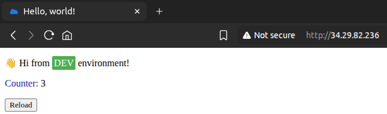
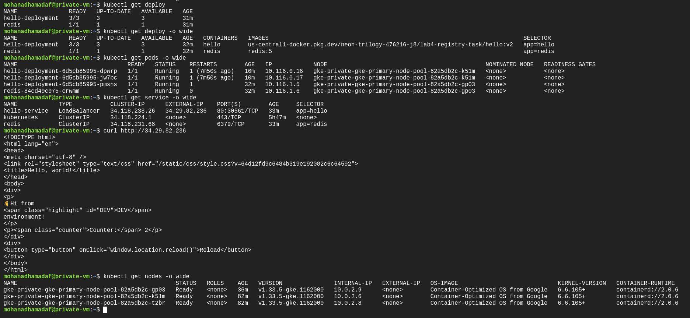
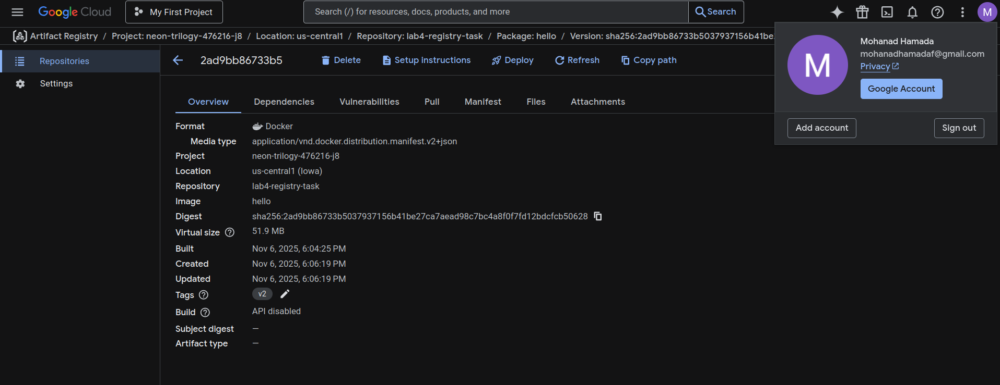
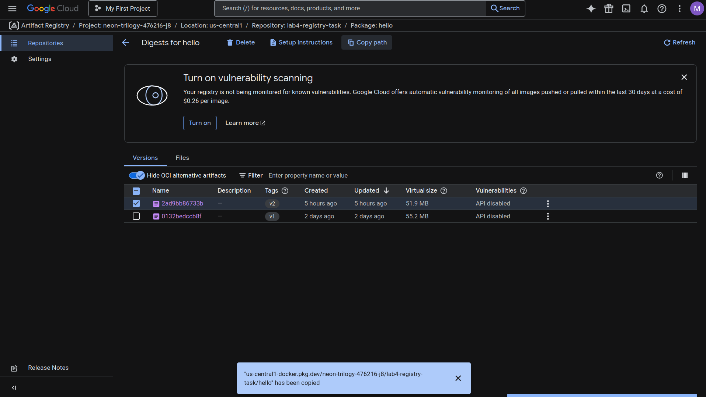
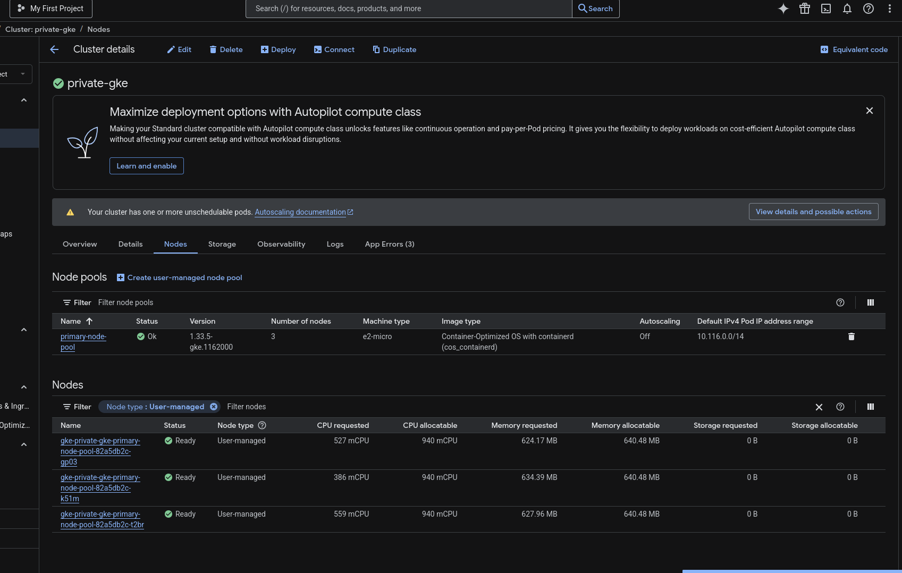
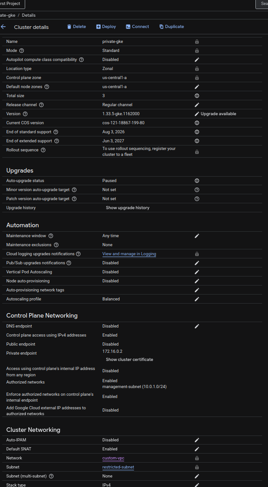
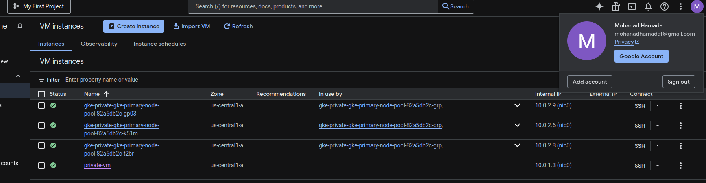
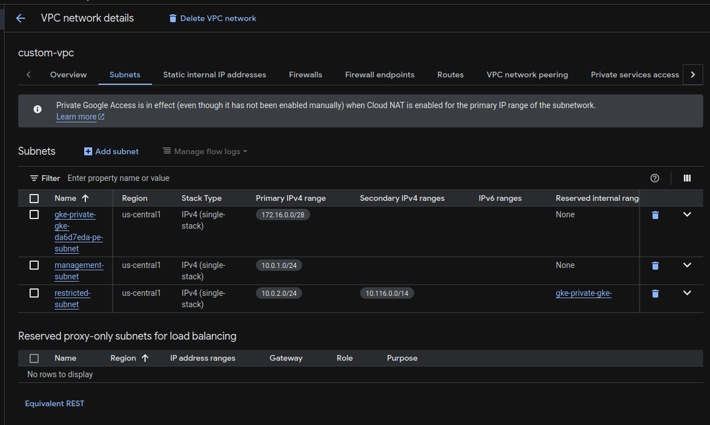
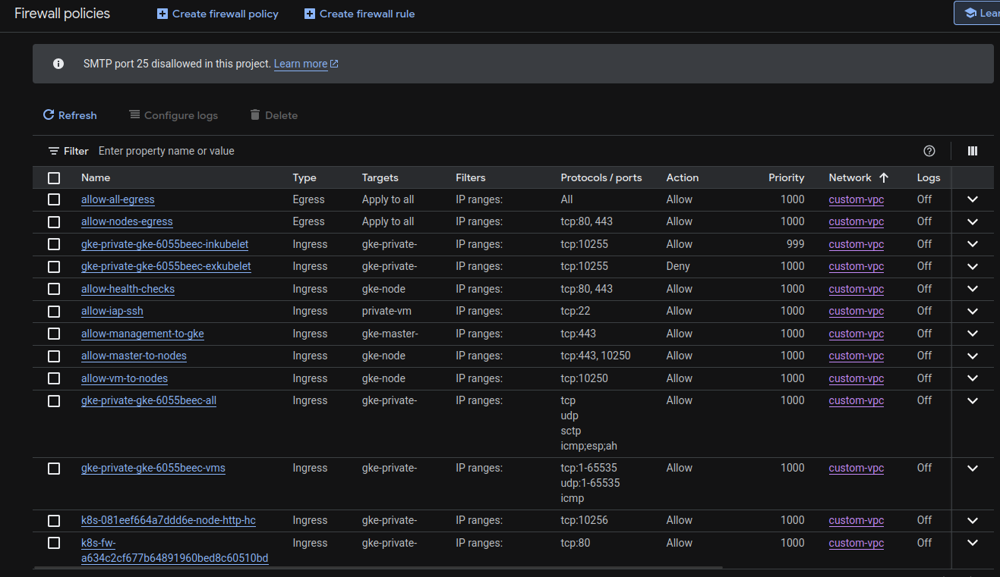
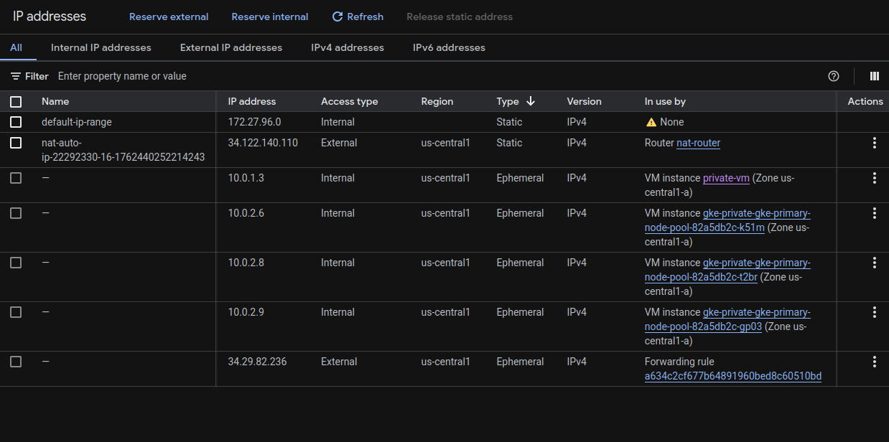
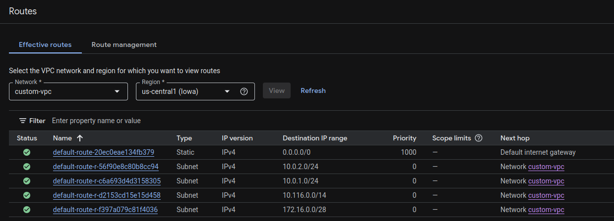
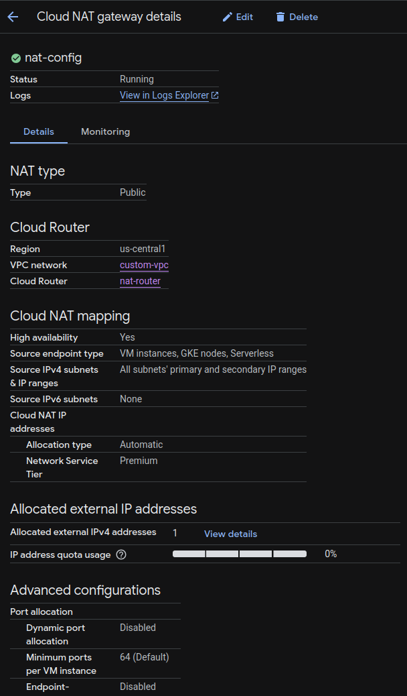
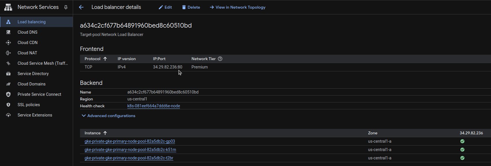
